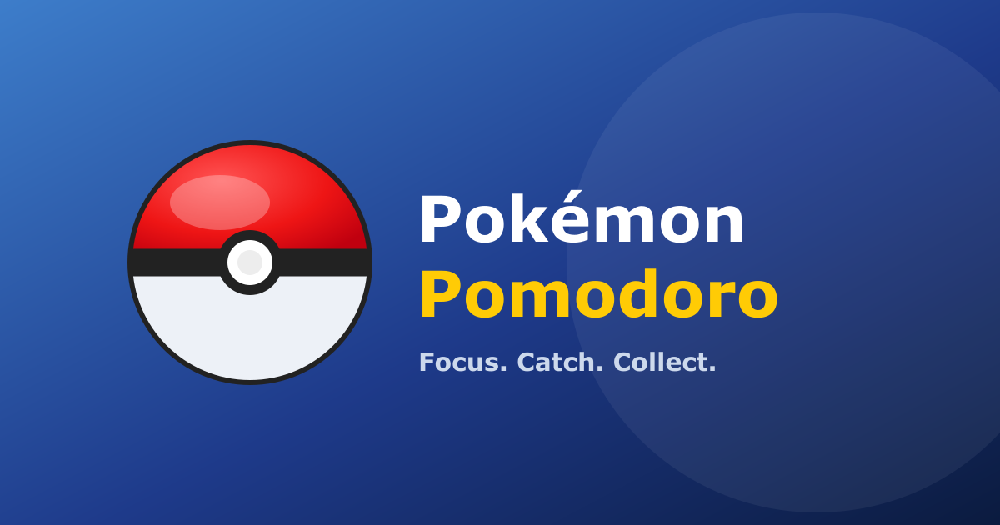

# Pokémon Pomodoro



A Pokémon-themed Pomodoro timer that gamifies productivity. Complete focus sessions, catch surprise Pokémon, and build your personal Pokédex. Track stats, share collections, and compete with friends.

## How it works

1. **Set your goal** — write what you'll work on this session
2. **Pick a duration** — 25, 45, 60 minutes, or a custom time
3. **Start the timer** — focus until it rings
4. **Catch a Pokémon** — when done, a Pokéball shakes and opens to reveal your catch (surprise! 898 possible Pokémon)
5. **Build your Pokédex** — every caught Pokémon is saved with your goal and the capture date

## Features

- **Timer**: Animated circular timer with SVG ring, visual states (red → yellow → green) and a glowing focus mode
- **Pokémon Catching**: Shaking Pokéball animation + reveal, 898 possible Pokémon via [PokéAPI](https://pokeapi.co/), with the Pokémon's official cry playing on capture
- **Generation Filter**: Restrict captures to Gen I through Gen VIII
- **Pokédex**: Full-color cards by type, rarity badges (Common → Legendary), capture goal and date
- **Personal Stats**: Sessions completed, total focus time, day streak, unique Pokémon caught
- **Focus Mode**: Dims distractions and enlarges the timer during an active session (exit anytime with Esc)
- **Notifications**: Browser notifications when timer ends (with permission)
- **Sharing**: Share your Pokédex via URL to compare collections with friends
- **Import/Export**: Backup your collection as JSON
- **Language Support**: EN / ES toggle with auto-detection based on browser locale
- **Theming**: Light / Dark toggle, defaults to your OS preference on first visit
- **Installable**: PWA with manifest + icons — add it to your home screen
- **Analytics**: Optional Google Analytics (GA4) with cookie consent
- **Sounds**: Synthesized completion/achievement sounds via the Web Audio API
- **Persistent Storage**: Collection saved to `localStorage`

## Stack

- [Next.js 16](https://nextjs.org/) — Pages Router, Turbopack
- React 19
- [Motion](https://motion.dev/) (Framer Motion) for animations
- Plain CSS (no UI framework) with CSS variables for theming
- PokéAPI (no API key required, free)

## Getting started

```bash
npm install
npm run dev
```

Open [http://localhost:3000](http://localhost:3000).

## Colors

| Color | Usage |
|-------|-------|
| `#EE1515` | Pokémon red — primary actions, timer ring |
| `#FFCB05` | Pikachu yellow — warning state, capture banner |
| `#003A70` | Dark blue — titles, key text |
| `#3D7DCA` | Pokémon blue — generation selector accent |

## Completed Features

- ✅ Personal stats dashboard (sessions, total time, streaks, unique count)
- ✅ Browser notifications when the timer ends
- ✅ Generation filter (catch Pokémon from specific generations)
- ✅ Share your Pokédex via URL for rival comparisons
- ✅ Export / import JSON backup
- ✅ Bilingual support (EN/ES) with auto-detection
- ✅ Light / Dark theme, defaults to your OS preference
- ✅ Focus mode for distraction-free sessions
- ✅ Achievements system with unlockable badges
- ✅ Installable PWA (manifest + icons)
- ✅ Open Graph / Twitter card previews for sharing
- ✅ Google Analytics integration with cookie consent
- ✅ Code splitting and lazy loading for performance

## Contributing

Found a bug? Have an idea? [Contribute on GitHub](https://github.com/santichausis/pokemon-pomodoro) — pull requests welcome!
